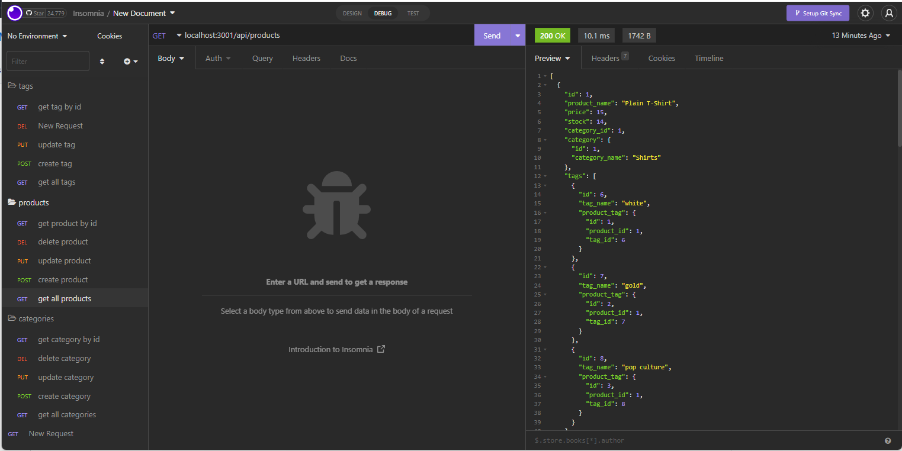

# Back-End-E-Commerce

## Description

This is a back end application designed to provide the ability to track, update, and delete category, product and tag items within a retail e-commerce site. This allows the business to keep track of their categories, their products and their product IDs but also allows them to make updates as needed to the system so it reflects accurately at any given time. Since this system keeps an accurate recording of the business product, they can then generate accurate reports to track financials as well as create forcasts for future profits and goals.

[Back-End-E-Commerce Demo Video](https://drive.google.com/file/d/1pmFC0QcRkRylUmICiXc-mMLY1C_QhVUp/view)

[GitHub Link](https://github.com/Angi-Adema/Back-End-E-Commerce)

## Acceptance Criteria

GIVEN a functional Express.js API
WHEN I add my database name, MySQL username, and MySQL password to an environment variable file
THEN I am able to connect to a database using Sequelize
WHEN I enter schema and seed commands
THEN a development database is created and is seeded with test data
WHEN I enter the command to invoke the application
THEN my server is started and the Sequelize models are synced to the MySQL database
WHEN I open API GET routes in Insomnia for categories, products, or tags
THEN the data for each of these routes is displayed in a formatted JSON
WHEN I test API POST, PUT, and DELETE routes in Insomnia
THEN I am able to successfully create, update, and delete data in my database
